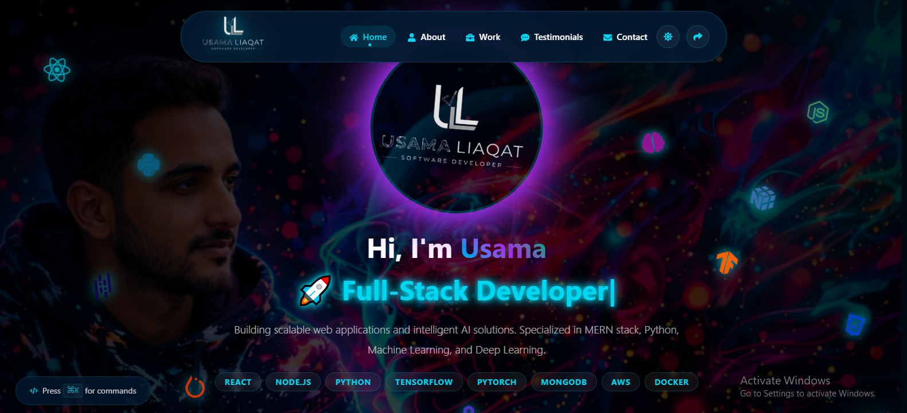
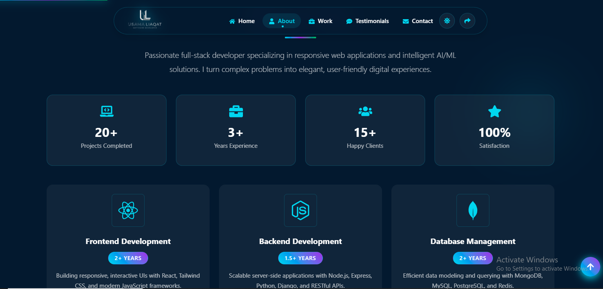
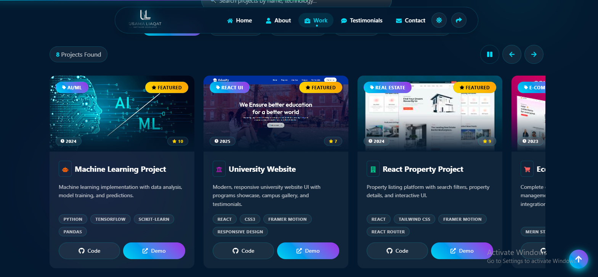
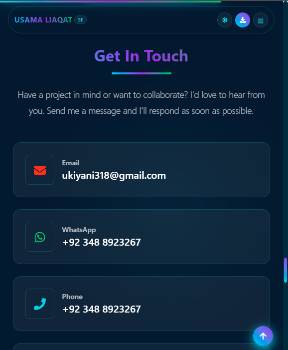

# 🚀 React Portfolio - Usama Liaqat

A modern, responsive personal portfolio built using React + Vite with smooth animations and dark/light theme support.

## 🌐 Live Demo
👉 https://react-personal-portfolio-iota.vercel.app/

---

## 📌 Features

- 🌙 Dark / Light Theme Toggle
- 📱 Fully Responsive Design
- 🎨 Smooth Animations (Framer Motion)
- 📊 Scroll Progress Indicator
- 🔥 Active Section Highlight
- 📤 Share Portfolio Feature
- 📄 Download Resume Option
- ⬆ Scroll to Top Button
- ⚡ Fast Performance with Vite

---

## 🛠 Tech Stack

- React (Vite)
- Framer Motion
- React Icons
- Bootstrap
- Context API
- CSS Variables

---

## 📸 Screenshots

### 🏠 Home Section


### 👤 About Section


### 💼 Work Section


### 📱 Mobile View


---

## 📂 Installation

Clone the repository:

```bash
git clone https://github.com/Usama112222/React_personal_Portfolio
Install dependencies:

npm install
Run locally:

npm run dev
Build project:

npm run build
🚀 Deployment
Deployed on Vercel.

📬 Contact
Usama Liaqat
Software Engineer
Email: ukiyani318@gmail.com

